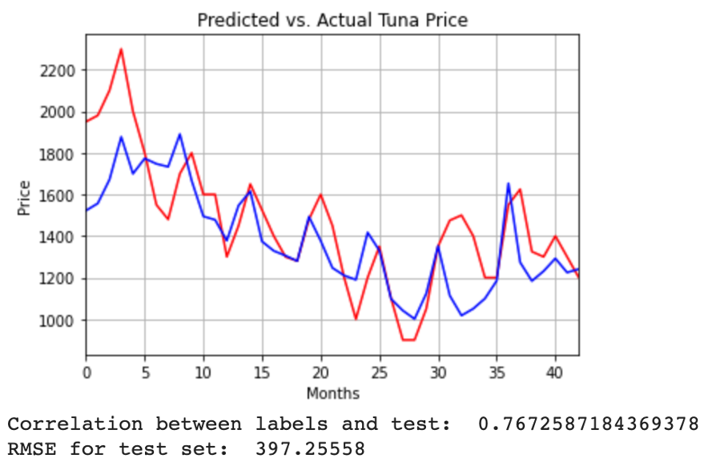

# Are International Tuna Prices Impacted by Environmental Variables?  

*Hugo Cesar Camou Campoy, Josh Kennedy, Reed Abraham, Roopa Bharadwaj*  
Machine Learning for Business Applications 1  
Tepper School of Business, Carnegie Mellon University  
May 5, 2021

**The aim of this project is to predict international prices of skipjack tuna given a series of environmental and economic factors.**

## **TOP TO DO LIST**

1. Citations pass
   1. Do citations have unique numbers
   2. Do the citations link to the appropriate reference
2. Figures pass
   1. Are all figures labeled and captioned
   2. Do figure numbers ascend properly
3. Tense pass
   1. Is everything uniformly 3rd person?
   2. Numbers: do we write out single digits "one" or use numerics? "1"
4. Conclusion draft
5. Pass for redundancy to check whether we are redundant in anything
6. Feature count pass
   1. we have a bunch of places that call out different features
   2. Do we need a section in the data overview that talks about different data sets?
      1. Raw
      2. flat / standardized
      3. Lasso fit
      4. PCA
      5. flat / standardized with harmonics
      6. PCA with harmonics?

## Introduction & Overview

International and local efforts are crucial to guarantee the balance between the sustainability of the catch and the worth of the industry. Tuna is most consumed fish and the second most important fish by wild capture in the world (with 5.2 million metric tons in 2018 ), and the industry around it contributes more that 40 billion dollars to the global economy per year. Even when the catch has been increasing year after year, tuna prices have plummeted since 2012 , destroying in the process 1.8 billion dollars in value, not to mention that the increased catch threatens the sustainability of the activity.

This is aggravated by a lack of international coordination: there is not one single sanctioning body that concentrates efforts on a global context. For example, in the Pacific Ocean, the fastest growth and main producing region of tuna, three different international associations 

**#TODO: Should we define these acronyms?** 

(IATTC , WCPFC and the CCSBT ) establish the norms for the catch, sometimes with overlap in the areas. Even in a regional scale, lack of coordination is evident: in this year, the IATTC did not establish international catch quotas for the eastern Pacific, after its members failed to reach consensus . An accurate and unbiased prediction of prices, paired with other environmental and production models can provide the confidence to work on a global context, and the necessary context to determine the optimal regulatory framework.

Price prediction for commodities in general and food supplies in particular is a topic of common interest. Academic research has intensively proposed price and production (catch) prediction models using traditional statistical analysis [[1]](#1), financial valuation approaches [[2]](#2), random forests and vector machines [[3]](#3), and machine learning [[4]](#4) with different degrees of success. Currently, no method or model is universally accepted as a reliable and standard predictor.

# TODO: Move to citation block
> [[1]](#1) Onour, Ibrahim and Sergi, Bruno, Modeling and forecasting volatility in the global food commodity prices (January 1, 2011)

> [[2]](#2) Chen, Yu-Chin and Rogoff, Kenneth S. and Rossi, Barbara, Predicting Agri-Commodity Prices: An Asset Pricing Approach (May 10, 2010)

> [[3]](#3) Dabin Zhang, Shanyin Cheng, Liwen Ling and Qiang Xia, Forecasting Agricultural Commodity Prices Using Model Selection Framework With Time Series Features and Forecast Horizons (February 4, 2020)

> [[4]](#4) Jabez Harris, A Machine Learning Approach to Forecasting Consumer Food Prices (August 2017)

Machine Learning is an adequate tool to develop a pricing model, and can potentially surpass the prediction accuracy of other methods. Traditional statistical analysis relies on the assumption of invariability in time, which does not hold in the tuna industry context. Juvenile depletion caused by excess catches, global warming effects on the life cycle of tuna, and changes in food consumption preferences can all impact pricing. A machine learning model can deal with these circumstances by continuously getting new information and updating its predictions automatically. In this way, an ML model can remain current for the next prediction horizon.

## Data Collection

### Starting Point & Data Collection

The data collection process was designed for agnosticism to biases towards assumed factors of influence to the price. The process generated a list of the candidate areas of data with predictive capabilities. The initial list included a variety of sources & hypotheses:

#### *Environmental Data: Was the lifecycle of Tuna somehow impacted by changing global conditions?*

- Water Temperatures & Variances
- Land Temperatures & Variances
- Ocean Currents & Wave Patterns
- Sea Winds
- Sea Ice Levels
- Sea Level Pressures
- Precipitation

#### *Fishing & Harvesting Data: Certainly there must be a relationship between the levels of fishing & harvesting, but to what extent?*

- Pounds of Tuna Harvested
- Pounds of Substitute Fish Harvested
- Fishing License Statistics
- Government Fishing Regulations

#### *Commercial Activity Data: Producers and consumers work hand-in-hand to impact prices, but what drives prices?*

- Producer Price Indices for Seafood-adjacent Industries
- Price Indices of Tuna substitutes (Shrimp, Chicken, etc. .)
- Import & Export Prices Indices
- Sushi & Seafood Restaurant Performance
- Consumer Preferences

### Data Collection Process

In practice, much of the tuna & fishing specific data was found to be proprietary and sparse. Available fishing data was dispersed across each government's networks and there was no global organization to consolidate and distribute the data.

The richest datasets were related to environmental factors. The National Oceanic and Atmospheric Administration (NOAA) provides robust datasets related to temperatures. The European Commission funds a "Climate Data Store" (Copernicus) that provides a wealth of data.

Federal Reserve Economic Data (FRED) provided a number of datasets related to commercial & economic data.

## Model Data Sources

As a result of the available data, the majority of our model inputs are monthly aggregations of environmental factors. A detailed summary of the various inputs can be found here:

**NOAA:** Monthly land-ocean temperature datasets were compiled via ASCII Time Series Data Access.
> https://www.ncdc.noaa.gov/noaa-merged-land-ocean-global-surface-temperature-analysis-noaaglobaltemp-v5

**Copernicus:** Our broad Monthly Sea Dataset was compiled via the "Climate Data Store" in GRIB format. We then used the Pygrib package to extract, transform, and join to our NOAA dataset.
> https://cds.climate.copernicus.eu/cdsapp#!/home

**NSIDC:** Our Monthly Sea Ice Dataset was compiled via FTP.
> https://nsidc.org/data/g02135

**FRED:** A number of features were collected from FRED.
> https://fred.stlouisfed.org/

- Seafood Product Preparation & Packaging Producer Price Index
- Fish and Seafood Markets Producer Price Index
- Global Fish Price Index
- Global Shrimp Price Index
- U.S. Fish & Shellfish Import/Export Price Indices

All of these sources were filtered and joined together via custom Python E/T job.

**#TODO Debate merits of swapped data section up here**
## Data Characteristics and Input Considerations

@Reed

### Data Characteristics

**#TODO: Header section possibly describing data attributes. What is the average Tuna price? What does the tuna price look like over the period we are trying to predict? Give context to the reader when evaluating MSE, etc**

#### Non-Uniform Data length

Climate data generally had a longer total history than market data. Market data itself had an inconsistent total history due to the diversity of sources.

To simplify model implementation the basic data set was truncated at the minimum history length. Techniques such as padding or multi modality were not investigated due to time constaints, but would be a logical next step.

#### High Colinearity

Heterogenous data sources and a "more-is-better" collection approach yielded an initial dataset with high colinearity.

**Fig. n** - #TODO: Place Image *Josh's colinarity screenshot should go here*

All climate data included multiple statistics for each time step. Economic data included common metrics such as maximums, minimums, and variances within the reporting period. While useful for human analysis it is unlikely many of these fields contributed meaningfully to our models. This was quantified through variable selection methods and dimensionality reduction attempts.

#### Feature Count vs. Sample Size

Clipping the data at the minimum available length yielded 121 months of data versus 432 covariates targeting a single output variable (the monthly price of skipjack tuna). A 4 to 1 covariate to history length is unfavorable (**#TODO find some citation on recommended data length**) for deep learning applications.

The width vs. depth of our data points to a set of preliminary directions:

- Using dimensionality reduction methods
- Avoiding deep or nested networks (**#TODO - does this statement disqualify any of our good models?**)
- Exploiting other information contained in the series structure or pattern

#### GeoSpatial & Time Series Combination

All features were time series non-categorical data except for the calendar month and calendar year. Climate data sources had associated latitude and longitude metadata. Data structural characteristics were of key concern to mitigate the unfavorable data length to covariate count. Two strategies were identified:

- Capture repeatable time series characteristics.
- Include geospatial relative or absolute positions as covariates.

The latter (geospatial covariates) was identified as being significantly harder than the former (time series characteristics) and de-prioritized due to project schedule requirements. Climate data were flattened and not associated with relative position aside from covariate names.

Temporal characteristics were maintained and explored both through use of networks with memory (recurrent neural networks, long short term memory) and including time harmonics in the same example for input into multi-layer perceptrons.

### Feature Selection and Preprocessing

#### Ridge Regularization

**#TODO: Final feature count verification + time history count verify**
**#TODO: check with Josh re. how he wants to shift 1st to 3rd person here**

Since we began with 433 features with unknown, but certain, relationships, we knew that feature selection would be important to our model. Building a correlation matrix, we can easily see certain elements that would detract from the model (see figure X for colinearity example). By implementing a Ridge regression for regularization, we are able to identify 210 features that could be removed from the data.
> Inspiration and methodology from Akash Dubey

#### Principle Components

PCA @Hugo

**#TODO: consider moving several sections from the LeNet preprocessing up here**

Principle component analysis captured ~90% of dataset variability contained within 16 covariates.

**#TODO: We will probably need a good reason why not all of our models used this preprocessing**

## Linear Forecasting Baseline

Traditionally most time series analysis are univariate in approach. Other variables are not incorporated because the features themselves may have predicted values which will propagate to the time series variable being predicted. We wanted to test this approach of time series forecasting to to see if they perform better on predictions than those using features.

### Time Series Forecasting

The usage of time series models here is twofold:

- Obtain an understanding of the underlying forces and structure that produced the data
- Fit a model and proceed to forecast.

Time series analysis is the splitting of time series into 4 parts:
1. **Level**: Long-term gradual changes in the series.
1. **Trend**: The increase or decrease in data over a period of time.
1. **Seasonality**: When time series is affected by seasonal factors, a seasonal pattern occurs.
1. **Noise:** The variability in the observations that cannot be explained by the model.

These components combine in some way to provide the observed time series. For example, they may be added together to form a model such as:

`Y = levels + trends + seasonality + noise`

### Automatic Time Series Decomposition

The Statsmodel python library provides a function `seasonal_compose()` to automatically decompose a time series. The additive model was used for preliminary assessment of time series linear trending and seasonality.

**Fig. 1** - *Automatic Time Series Decomposition*

Seasonalities were also assessed using a manual polynomial fit.

**Fig. 2** - *Polynomial fit to find seasonalities*

We can see how the model to find a seasonality fits well to our data.

### Stationarity

As a test for checking Stationarity, we used both Autocorrelation and partial autocorrelation plots as well as *Dickey-Fuller* test. The purpose of using a Dickey-fuller test was to see how strongly our time series was defined by a trend.

The null hypothesis of the test is that the time series can be represented by a unit root and has some time-dependent structure. The alternate hypothesis (rejecting the null hypothesis) is that the time series is stationary. [[7]](#7)

**Fig. 3** - *Dickey-Fuller test, Auto and Partial Correlation, Rolling mean and standard deviation*

With a p value of 0.23 indicates this series is a candidate for methods to make the target series stationary such as log scale transformation or smoothing.

### Methods for Time Series Forecasting

When looking at our data the main split was whether we had extra regressors (features) to our time series or just the series. Based on this we started exploring different methods for forecasting and their performance in different metrics.[[7]](#7)

We split our data into test training sets having 85 months of training data and 36 months of testing data.

#### Univariate Time Series Analysis

Three univariate time series models were fitted to the data to assess performance:

- Auto Regression (AR)
- Autoregressive integrated moving average (ARIMA): Combination of moving average and auto-regression model.
- Seasonal Autoregressive moving average (SARIMA): Extends ARIMA model by adding seasonal past values and/or forecast erros.

The following plots show the predictions on or 36 months test data by using Auto Regression (AR) and SARIMA models.

##### **Auto Regression (AR)**

**Fig. 4** - *Auto Regression model*

##### **Seasonal Autoregressive Integrated Moving-Average (SARIMA)**

**Fig. 5** -*Seasonal Autoregressive Integrated Moving-Average (SARIMA) model*

Both models did a decent job of predicting on the validation set.

#### Multivariate Time Series Analysis

In order to better understand and use the relationship between several variables and for describing the dynamic behavior of the data for better forecasting results, we also tried some multivariable time series models like Random Forest and XGBoost.

##### **Random Forest (RF)**

A number of decision trees (in our case we used 5) are created where each tree is created from a different sample.

**Fig. 6** - *Random Forest model*

##### **XGBoost**

Rather than training all of the models in isolation of one another like random forest, we tried an XG Boost model to train models in succession.

**Fig. 7** *XGBoost model*

Random Forest/XGBoost at best, can predict an average of previously seen training values. Random Forest/ XG Boost is not providing desired results as it is unable to extrapolate to understand the decreasing trend in our data. Because of this, answering questions like “What would the price of SkipJack Tuna be for next Year?” becomes really difficult when using Random Forests/XG Boost.

### Evaluation Metrics

There are many measures that can be used to analyze the performance of our prediction so we will be using the top 4 most used metrics for time series forecasting.

- Mean Absolute Error (MAE)
- Mean Absolute Percentage Error (MAPE)
- Root Mean Squared Error (RMSE)
- R2 Coefficient of Determination (r2)

**Fig. 8** - *Result metrics*

### Conclusions

Although, linear models is a standard method for time series forecasting, it is hard to model nonlinear relationship using them. We have ensured we have exhausted classical time series forecating methods nonetheless, to test our forecasting problem prior to exploring machine larning methods. Other techniques of forecasting like Neural Nets overcome some of the limitations of Classical methods. 

## Machine Learning / Deep Learning Model Results

### Baseline Results - MLP

An attempt was made at training a flat model without filtering the features and with no pre-processing. The model failed to pick any signal, as can be seen in the following plot:

**Fig. 9** - *Confusion Matrix and Estimated Error for k = 5*

### Classification Transform

The problem was transformed from a continuous to a discrete output to try to improve the performance of the model. This experiment had two variations:

1. Distribute the prices in equal sized buckets (with trials for 3, 4 and 5).
2. Binary: provide directionality in terms of price increase or decrease with respect to the previous period.

The dispersion and range of prices within any given training and testing set was very similar so to avoid recalculating the buckets on each trial the whole set was used. Since the dataset was shuffled, the risk of bias remained very low, however other temporality concerns arose (to be discussed later in the report).
**#TODO: Sounds like a good candidate to be elaborated upon in the data description lead up**

In the price bucket variety classification accuracy decreased as the number of buckets increased. At the same time an estimated RMSE loss was reduced. The estimated RMSE was based on the difference of the averages of the buckets instead of the difference of the average of the bucket and the actual price making the estimated RMSE lower that the actual RMSE. This can be seen in the following confusion matrix:

**Fig. 10** - *Confusion Matrix and Estimated Error for k = 5*

**Fig. 11** - *Confusion Matrix and Estimated Error for k = 4*

**Fig. 12** - *Confusion Matrix and Estimated Error for k = 3*

The price directionality variety model was sub-par. The model selected only one of the labels for the entire dataset. Additionally it was not consistent in the election since both labels have an occurrence probability of 50%.

The three main limitations of a discrete approach to the problem were the implication that price was limited to a fixed range known in advance, inaccurate classification, and the rigidity of a discrete prediction. Furthermore, the decrease of the estimated RMSE as the number of buckets increased is a strong indicator to keep the model as a continuous approach.

Finally, since trials were made shuffling the whole set, the model was filling voids in the past instead of predicting the future. This realization was taken into account in the next models so that data was split by time rather than by volume.

**#TODO: Should we rename this since it's not actually leNet?**
### LeNet Adaptation

**#TODO: Feature number consistency, how many do we actually have?**
A challenge to train with the available data was that the number of features (484) was greater than the number of examples (121). Furthermore, the existing number of features did not show sufficient explanatory power in previous models. To deal with this, four different alternatives were explored, and those that were successful were merged into a model:

**#TODO: Should we consider moving this up into the data exploration section and then noting in here that X dataset was used on this model to good effect?**
#### **Synthetizing new examples to train the model.** 

This was done with a PCA encoding that kept the maximum possible amount of components in the whole dataset (including the target), and then random noise was injected into the decoder. However, given that the maximum decoding matrix size achievable was 121 X 121, 364 features were lost in the process (producing a loss in variance explanation), and therefore the output was not similar enough to the original dataset to be used as a training set. A manual selection that removed the additional 364 features before applying the PCA encoding and decoding could have solved the problem, however due to time constraints, this approach was not attempted.

#### **Selecting the most significant covariates.**

A PCA encoder was used to select the most meaningful components, and train the model using them instead of the actual features. Several trials were made with different cutoff parameters, and the final decision was to keep the most relevant 16 components (with a loss of 21% in the variance explanation). 

#### **Adding covariates that could complement the existing information.** 

During exploratory analysis, it was found that tuna prices followed a cyclical pattern, and that prices at a given point in time are related to adjacent historic prices. Time cyclicity was included into the model by breaking the signal into Fourier harmonics. To ensure that low frequencies remained the most relevant, the first harmonic parameters for time offset and length of the period were determined by minimizing MSE. Using those parameters, the six lowest frequencies were calculated and incorporated to the dataset.

**Fig. 13** - *Adjustment of Lowest Frequency Harmonic*

The advantage of using Machine Learning instead of applying Fourier Series directly, was that coefficients for each harmonic could be determined in context with the rest of the covariates.
Additionally to the harmonics, two price related covariates were added to the dataset: the price average for the last 6 periods and the change in price between `t-2` and `t-1`. 

#### **Establishing a network that could generalize a large set of features.** 

**#TODO: Need a citation to the original LeNet paper**
A CNN based on LeNet’s architecture was used to train the model. The input for this model were the resulting 16 main components after applying PCA plus the additional 8 variables. This was arranged in a 3 X 8 input matrix. The temporal split between the train and the test sets was made at 65/35% to ensure that the cycle described by the first harmonic was completely included in the training set. Data was randomized only for the train set after the split. The results of this model were better than the previous attempts, and a RMSE of 397 was obtained (for context, the average price was $1,577), with a correlation of 0.76.  

**Fig. 14** - *Performance of LeNet Network*

This model relies on the assumption that the price cyclicity observed will continue in the future, i.e. that it was not a matter of chance. The full cycle encompasses roughly five years, and could be produced by multi-annual weather patterns such as El Niño or La Niña. However, the recurrence of this pattern in the future is uncertain (and outside the scope of this project), and should be further analyzed to assure the applicability of the model in a general context.

- Actually not Lenet just did a really good job of pre-processing the datawith PCA
- 7 harmonics of various parameters included in PCA so 'pseudo-history' is included in model

### LSTM

The target variable's seasonality and time-based nature points to a LSTM network as well suited. Strong results were found when applying a standard implementation of this type of model: loss of 0.00509 over 3,000 epochs with lr of 0.03

### LSTM, Rolling Window

Success of the first LSTM inspired a secondary LSTM approach. The objective was to structure input data to capture seasonality without creating dependence on the structure of the data's macro-trend.

Examples were restricted to 12-length sequences, 4 sequences per batch for training. Test data was the most recent 12-period sequence, validation was the 12-period sequence prior to that.

Results were inconclusive as the project ended prior to completing the implementation.

### Temporal Fusion Transformer (TFT)

Data complexity led to an investigation of open source libraries and tools designed to perform time series analysis on targets with many covariates. PyTorch Forecasting [[#TODO CITE: PyTorch Forecasting]], an extension of PyTorch Lightning [#TODO CITE: PyTorch Lightning] emerged as a candidate for open source application.

PyTorch Forecasting's advantages included:

- Pre-written building-blocks for net design including structures for custom data objects, data loaders, and a pre-structured model trainer and evaluator object.
- Boilerplates for complex model structures such as the "Temporal Fusion Transformer" (TFT).
- Built-in plotting, evaluation, and hyper-parameter methods.

PyTorch Forecasting's Disadvantages Included:

- Low-visibility into pre-written routines and methods.
- Coding and structural conventions and practices which were time-consuming to learn.

The Temporal Fusion Transformer is a recently introduced neural network architecture that combines RNN and CNN design elements. [#TODO CITE: Tft Paper]

**Fig. n** - : *TFT Architecture* [#TODO: Cite Tft Paper]

TFT advantages include:

- Built-in variable selection
- Capability to fuse categorical and time-series data
- Capability to differentiate between unknown and known future data for a given prediction horizon (e.g. future prices versus the month for the next 3 cycles).

TFT implementation used example code from PyTorch Forecasting libraries. Experimental forecasting horizons included 1, 2, 4, and 60 periods (months). Experimental maximum sequence lengths included 6, 12, 20, 24, and 60 periods (months). Training and Validation data were split by witholding the most recent forecasting horizon from the data set (e.g. the last 4 months) and then training on random sequence length selections within the earlier data.

The TFT's recurrent block was examined using a hyper-parameter optimizer. Hidden network size was varied between 12 and 32, the attention head size was varied between 1 and 4, gradient clip was between 0.01 and 0.5, and the dropout between 0.05 and 0.3. Frequently larger networks were found optimal (~20 hidden depth) but computational resource limitations precluded their full use or investigation. Assured access to more powerful GPUs would have enabled more exploration.

**Fig. n** - *TFT Results Predicting Ahead 4 Periods Using 20 Previous*

As typical with forecasting neural networks accuracy suffered as a strong function of forecast horizon and generally improved with training on greater sequence lengths.

**Fig. n** - *TFT Results Predicting Ahead 1 Period Using 23 Previous*

TFT implementation was not robust and hard to validate and evaluate. Use of the single, latest time period for validation **#TODO: Complete this thought Reed*

True implementation would require examination of Pytorch Forecasting's libraries to prove faithful representation of the design. Additionally the TFT's tested accuracy was highly dependent on hyper-parameters. No decomposition or normalization was performed on TFT inputs in order to test the claimed integrated variable selection and scaling routines of PyTorch Forecasting. The TFT's capability to schedule certain weights by defining "categories" of inputs was not tested.

While inconsistent the TFT's capabilities and PyTorch Lightning's features suggest them as prime candidates for study given more time for validation and implementation.

### Future Work

Pricing projection based on diverse inputs is an area of research interest. Given more time a number of novel technologies and techniques could be applied to this problem.

#### Multi Modal Neural Networks

This project would be well suited to apply a multi modal neural network. The diversity of data sources in length and general characteristics (geospatial vs. abstract) mean there are probably advantages towards separately applying a variety of neural networks to different sources of the data.

Geospatial Multi Modal applications in general are an area of active research.

#### Spherical Convolutional Neural Networks

The structural information inherent in the climate information based on the data location was ignored for all models in this project. Traditional convolutional neural networks would not capture the structural information appropriately due to the 2-dimensional rectilinear structure of their inputs. For example 180 degrees West would be interpreted as maximum distance from 180 degrees East.

There are several examples of CNN input structures modified for spherical geometry data. [#TODO PAPER EXAMPLE] There are additional examples of spherical CNNs being modified for geospatial data. Optimal modeling of the climate data would include a pass through a spherical CNN.

## Model Results

@All after model sections are written

- Expectations
- Results from model(s)
- Which model is best?

## Summary

- Overall broad summary (how does this relate back to the problem space?
- Broad findings
- How can this be used in the real world?

## References and Citations

### 3rd Party Python Packages, Methodology, & Functions

> [[7]](#7) Jaime Ferrando Huertas, https://github.com/jiwidi/time-series-forecasting-with-python

> [[1]](#1)Akash Dubey. "Feature Selection Using Regularisation", 
<https://towardsdatascience.com/feature-selection-using-regularisation-a3678b71e499>

> [[1]](#1)Jason Brownlee. "Time Series Forecasting with the Long Short-Term Memory Network in Python", 
<https://machinelearningmastery.com/time-series-forecasting-long-short-term-memory-network-python/

### Dataset Citations

> [[1]](#1) Hersbach, H., Bell, B., Berrisford, P., Biavati, G., Horányi, A., Muñoz Sabater, J., Nicolas, J., Peubey, C., Radu, R., Rozum, I., Schepers, D., Simmons, A., Soci, C., Dee, D., Thépaut, J-N. (2019): ERA5 monthly averaged data on single levels from 1979 to present. Copernicus Climate Change Service (C3S) Climate Data Store (CDS). (Accessed on [01-MAY-2021]), https://10.24381/cds.f17050d7

> [[1]](#1) Zhang, H.-M., B. Huang, J. Lawrimore, M. Menne, Thomas M. Smith, NOAA Global Surface Temperature Dataset (NOAAGlobalTemp), Version 4.0. NOAA National Centers for Environmental Information. doi: https://10.7289/V5FN144H [01-MAY-2021].

> [[1]](#1) Fetterer, F., K. Knowles, W. N. Meier, M. Savoie, and A. K. Windnagel. 2017, updated daily. Sea Ice Index, Version 3. Boulder, Colorado USA. NSIDC: National Snow and Ice Data Center. doi: https://doi.org/10.7265/N5K072F8. [01-MAY-2021].

> [[1]](#1) International Monetary Fund, Global price of Fish [PSALMUSDM], retrieved from FRED, Federal Reserve Bank of St. Louis; https://fred.stlouisfed.org/series/PSALMUSDM, May 2, 2021.

> [[1]](#1) U.S. Bureau of Labor Statistics, Producer Price Index by Industry: Seafood Product Preparation and Packaging: Fresh and Frozen Seafood Processing [PCU3117103117102], retrieved from FRED, Federal Reserve Bank of St. Louis; https://fred.stlouisfed.org/series/PCU3117103117102, May 2, 2021.

> [[1]](#1) U.S. Bureau of Labor Statistics, Producer Price Index by Industry: Specialty Food Stores: Fish and Seafood Markets [PCU445200445200102], retrieved from FRED, Federal Reserve Bank of St. Louis; https://fred.stlouisfed.org/series/PCU445200445200102, May 2, 2021.

> [[1]](#1) U.S. Bureau of Labor Statistics, Tuna, Light, Chunk, Per Lb. (453.6 Gm) in U.S. City Average [APU0000707111], retrieved from FRED, Federal Reserve Bank of St. Louis; https://fred.stlouisfed.org/series/APU0000707111, May 2, 2021.

> [[1]](#1) U.S. Bureau of Labor Statistics, Import Price Index (End Use): Fish and Shellfish [IR01000], retrieved from FRED, Federal Reserve Bank of St. Louis; https://fred.stlouisfed.org/series/IR01000, May 2, 2021.

> [[1]](#1) U.S. Bureau of Labor Statistics, Export Price Index (End Use): Fish and Shellfish [IQ01000], retrieved from FRED, Federal Reserve Bank of St. Louis; https://fred.stlouisfed.org/series/IQ01000, May 2, 2021.

> [[1]](#1) International Monetary Fund, Global price of Shrimp [PSHRIUSDM], retrieved from FRED, Federal Reserve Bank of St. Louis; https://fred.stlouisfed.org/series/PSHRIUSDM, May 2, 2021.

### Time Series Citations

> [[1]](#1)Davide Bruba. "An overview of time series forecasting models", 
<https://towardsdatascience.com/an-overview-of-time-series-forecasting-models-a2fa7a358fcb>

> [[2]](#2)Athul Anish. “Time Series Analysis”,
https://medium.com/swlh/time-series-analysis-7006ea1c3326

> [[3]](#3)Statworx Blog, “Time series forecasting with random forest”,
https://medium.com/@statworx_blog/time-series-forecasting-part-i-e30a16bac58a

> [[4]](#4)Indraneel Dutta Baruah, Analytics Vidya. “Combining Time Series Analysis with Artificial Intelligence: the future of forecasting”,
https://medium.com/analytics-vidhya/combining-time-series-analysis-with-artificial-intelligence-the-future-of-forecasting-5196f57db913

> [[5]](#5)Aman Arora, “Why Random Forests can’t predict trends and how to overcome this problem?”,
https://medium.datadriveninvestor.com/why-wont-time-series-data-and-random-forests-work-very-well-together-3c9f7b271631

> [[6]](#6)Jason Browniee, “How to Decompose Time Series Data into Trend and Seasonality”
https://machinelearningmastery.com/decompose-time-series-data-trend-seasonality/

### REED PAPER SCRATCHPAD (#TODO: Fix this)

> Jing Gao, Peng Li, Zhikui Chen, Jianing Zhang; "A Survey on Deep Learning for Multimodal Data Fusion." Neural Comput 2020; 32 (5): 829–864. doi:
https://direct.mit.edu/neco/article/32/5/829/95591/A-Survey-on-Deep-Learning-for-Multimodal-Data

> DeepSphere: Efficient spherical Convolutional Neural Network with HEALPix sampling for cosmological applications
https://arxiv.org/abs/1810.12186

> Deep Learning for Spatio - Temporal Data Mining: A Survey
https://arxiv.org/pdf/1906.04928.pdf

> Spherical CNNs
https://openreview.net/pdf?id=Hkbd5xZRb

> PyTorch Lightning
https://pytorch-lightning.readthedocs.io/en/latest/

> PyTorch Forecasting
https://pytorch-forecasting.readthedocs.io/en/latest/index.html

## Source Code

We have published all of our source code to a public Github repo:

[CMU MSBA Team 4 Code Repository](https://github.com/josh-kennedy-7/cmu_msba_team_4_2022)
